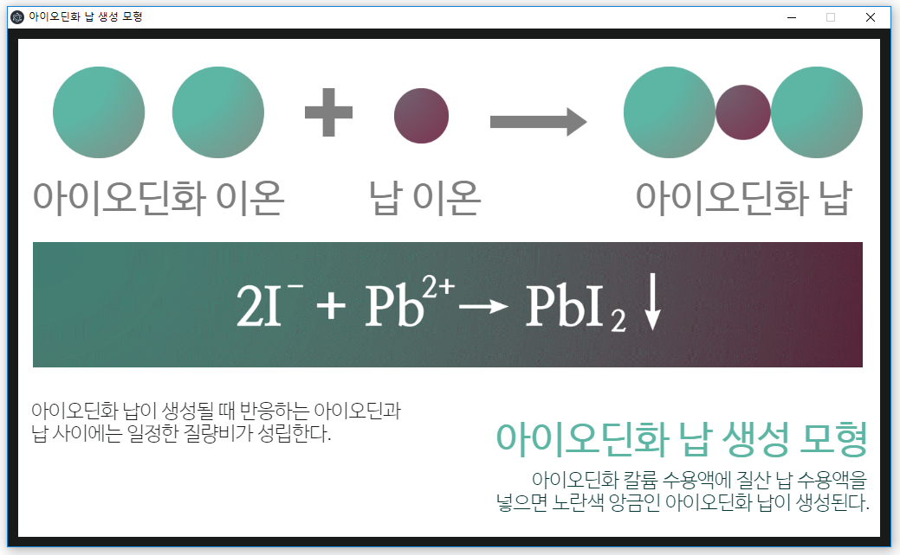

# Chemistry Desktop App

## generation of iodinated lead (아이오딘화 납 생성 모형)



말로만 Desktop App이지 사실 (적어도 지금은) 저 스크린샷이 다입니다. 진짜 다예요(그냥 저거예요).

각각의 오브젝트는 `Microsoft PowerPoint`로 제작하였고, `Adobe Photoshop`과 `Zeplin`을 사용해서 Layout을 설계했습니다.

`Electron`을 사용해서 Desktop UI를 제작했습니다.

중학교 3학년 과학 교과서(비상교육) 101페이지 그림 2-10의 내용입니다(수행평가 공부하다가 만들어버림).

## execution
프로젝트 폴더에서 아래 명령어를 사용하여 앱을 시작하세요.
```
$ electron .
```
아래와 같이 `npm start` 명령어를 이용해서 실행할 수도 있습니다.
```
$ npm start
```
